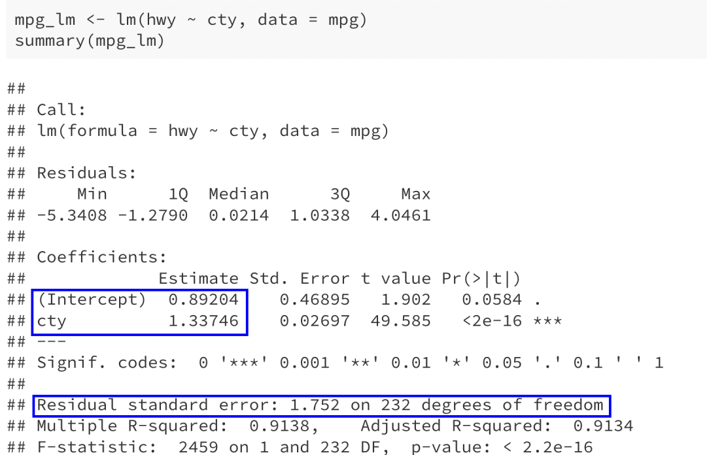

## Agenda

* Estimating residual variability
* Outlier detection
* Influential points
* Lab 4

---

## Linear regression model

.center[
$y = \beta_0 + \beta_1 x + \varepsilon$
]

where $\varepsilon \sim N(0, \sigma^2_{\varepsilon})$, and the $\varepsilon$ are independent from one another.

--

* **Parameters:** $\beta_0$, $\beta_1$, and $\sigma^2_{\varepsilon}$
* **Estimates:**

.center[
$\widehat{\beta}_1 = \dfrac{\sum_{i=1}^n (x_i - \overline{x})(y_i - \overline{y})}{\sum_{i=1}^n (x_i - \overline{x})^2}$

$\widehat{\beta}_0 = \overline{y} - \widehat{\beta}_1 \overline{x}$

$\widehat{\sigma}^2_{\varepsilon} =$ ?
]

---

## Linear regression model

.center[
$y = \beta_0 + \beta_1 x + \varepsilon$
]

where $\varepsilon \sim N(0, \sigma^2_{\varepsilon})$, and the $\varepsilon$ are independent from one another.


* **Parameters:** $\beta_0$, $\beta_1$, and $\sigma^2_{\varepsilon}$
* **Estimates:**

.center[
$\widehat{\beta}_1 = \dfrac{\sum_{i=1}^n (x_i - \overline{x})(y_i - \overline{y})}{\sum_{i=1}^n (x_i - \overline{x})^2}$

$\widehat{\beta}_0 = \overline{y} - \widehat{\beta}_1 \overline{x}$

$\widehat{\sigma}^2_{\varepsilon} = \dfrac{SSE}{n-2} = \dfrac{\sum \limits_{i=1}^n (y_i - \widehat{y}_i)^2}{n-2}$
]

--

$n - 2$ is the **degrees of freedom**

---

## In R

```{r include=F}
library(tidyverse)
```

```{r}
mpg_lm <- lm(hwy ~ cty, data = mpg)
summary(mpg_lm)
```

---

## In R

.center[

]

---

## In R

.center[

]

* $\widehat{\beta}_0 = 0.892$
* $\widehat{\beta}_1 = 1.337$
* $\widehat{\sigma}_\varepsilon = 1.752 = \sqrt{\dfrac{SSE}{n-2}}$
* $n - 2 = 232$

---

## Outliers

Votes for George Bush and Pat Buchanan, in Florida counties in 2000:

```{r echo=F, fig.width = 7, fig.height=5, fig.align='center', message=F}
library(Stat2Data)
data("PalmBeach")

PalmBeach %>%
  ggplot(aes(x = Bush, y = Buchanan)) +
  geom_point(size = 1.5) +
  geom_smooth(method = "lm", se=F) +
  labs(x = "Votes for Bush",
       y = "Votes for Buchanan") +
  theme_bw() +
  theme(text= element_text(size=20))
```

---

## Identifying outliers

**Standardized residuals:** $\dfrac{y_i - \widehat{y}_i}{\widehat{\sigma}_{\varepsilon}}$

**Studentized residuals:** Standardized residuals, but $\widehat{\sigma}_{\varepsilon}$ is computed after removing the observation in question

```{r echo=F, fig.width=7, fig.height=5, fig.align='center'}
vote_lm <- lm(Buchanan ~ Bush, data = PalmBeach)

PalmBeach %>%
  mutate(studentized_resids = rstudent(vote_lm),
         yhat = predict(vote_lm)) %>%
  ggplot(aes(x = yhat, y = studentized_resids)) +
  geom_point(size = 1.5) +
  geom_abline(slope = 0, intercept = 0, 
              color = "blue", lwd=1.2) +
  geom_abline(slope = 0, intercept = c(-3, -2, 2, 3),
              color = "orange", lty = 2, lwd=1.2) +
  labs(x = "Predicted votes for Buchanan",
       y = "Studentized residuals") +
  theme_bw() +
  theme(text = element_text(size = 20))
```

---

## Identifying outliers

```{r echo=F, fig.width=7, fig.height=5, fig.align='center'}
PalmBeach %>%
  mutate(studentized_resids = rstudent(vote_lm),
         yhat = predict(vote_lm)) %>%
  ggplot(aes(x = yhat, y = studentized_resids)) +
  geom_point(size = 1.5) +
  geom_abline(slope = 0, intercept = 0, 
              color = "blue", lwd=1.2) +
  geom_abline(slope = 0, intercept = c(-3, -2, 2, 3),
              color = "orange", lty = 2, lwd=1.2) +
  labs(x = "Predicted votes for Buchanan",
       y = "Studentized residuals") +
  theme_bw() +
  theme(text = element_text(size = 20))
```

* Slightly suspicious when studentized residual > 2 or < -2
* More wary when studentized residual > 3 or < -3

---

## Influential points

**How much does removing the point change the fitted line?**

```{r echo=F, fig.width=7, fig.height=5, fig.align='center'}
lm_1 <- lm(Buchanan ~ Bush, data = PalmBeach)
lm_2 <- lm(Buchanan ~ Bush, 
           data = PalmBeach %>%
             filter(County != "PALM BEACH"))

PalmBeach %>%
  mutate(pred_1 = predict(lm_1),
         pred_2 = predict(lm_2, 
                          newdata = PalmBeach)) %>%
  ggplot(aes(x = Bush)) +
  geom_point(aes(y = Buchanan), 
             size = 1.5) +
  geom_line(aes(y = pred_1), color = "blue",
            lwd = 1.2) +
  geom_line(aes(y = pred_2), color = "red",
            lwd = 1.2, lty=2) +
  labs(x = "Votes for Bush",
       y = "Votes for Buchanan") +
  theme_bw() +
  theme(text= element_text(size=20))
```

---

## Impact of influential points

$\widehat{\beta}_0$ and $\widehat{\beta}_1$ minimize $\sum \limits_{i=1}^n (y_i - \widehat{\beta}_0 - \widehat{\beta}_1 x_i)^2$


```{r echo=F, fig.width=7, fig.height=5, fig.align='center'}
lm_1 <- lm(Buchanan ~ Bush, data = PalmBeach)
lm_2 <- lm(Buchanan ~ Bush, 
           data = PalmBeach %>%
             filter(County != "PALM BEACH"))

PalmBeach %>%
  mutate(pred_1 = predict(lm_1),
         pred_2 = predict(lm_2, 
                          newdata = PalmBeach)) %>%
  ggplot(aes(x = Bush)) +
  geom_segment(aes(x = 152846, y = 796.81,
                   xend = 152846, yend = 3407)) +
  geom_point(aes(y = Buchanan), 
             size = 2) +
  geom_line(aes(y = pred_1), color = "blue",
            lwd = 1.2) +
  geom_line(aes(y = pred_2), color = "red",
            lwd = 1.2, lty=2) +
  labs(x = "Votes for Bush",
       y = "Votes for Buchanan") +
  theme_bw() +
  theme(text= element_text(size=20))
```

---

## Potential for influence

Points with $x$ far from $\overline{x}$ have more *potential* to be influential

.pull-left[
<ins>Possibly influential</ins>
```{r echo=F, fig.align='center', fig.width=6, fig.height=4}
set.seed(1)

x  = 1:100
y = 1:100 + rnorm(100, sd=10)

data.frame(x = x,
           y = y) %>%
  ggplot(aes(x = x, y = y)) +
  geom_point(size = 1.5) +
  geom_point(aes(x = 50, y = 120), color="red",
             size = 2) +
  theme_bw() +
  theme(text = element_text(size = 20))
```
]

.pull-right[
<ins>More influential</ins>
```{r echo=F, fig.align='center', fig.width=6, fig.height=4}
set.seed(1)

x  = 1:100
y = 1:100 + rnorm(100, sd=10)

data.frame(x = x,
           y = y) %>%
  ggplot(aes(x = x, y = y)) +
  geom_point(size = 1.5) +
  geom_point(aes(x = 100, y = 30), color="red",
             size = 2) +
  theme_bw() +
  theme(text = element_text(size = 20))
```
]

---

## Influential points

Influence depends on both $x$ and $y$

.pull-left[
<ins>Possibly influential</ins>
```{r echo=F, fig.align='center', fig.width=6, fig.height=4}
set.seed(1)

x  = 1:100
y = 1:100 + rnorm(100, sd=10)

data.frame(x = x,
           y = y) %>%
  ggplot(aes(x = x, y = y)) +
  geom_point(size = 1.5) +
  geom_point(aes(x = 50, y = 120), color="red",
             size = 2) +
  theme_bw() +
  theme(text = element_text(size = 20))
```
]

.pull-right[
<ins>Not influential</ins>
```{r echo=F, fig.align='center', fig.width=6, fig.height=4}
set.seed(1)

x  = 1:100
y = 1:100 + rnorm(100, sd=10)

data.frame(x = x,
           y = y) %>%
  ggplot(aes(x = x, y = y)) +
  geom_point(size = 1.5) +
  geom_point(aes(x = 100, y = 100), color="red",
             size = 2) +
  theme_bw() +
  theme(text = element_text(size = 20))
```
]

---

## Handling outliers and influential points

If the observation is clearly a measurement error:
* Remove it

Otherwise:
* Fit line with and without point, see how the estimated line changes
* If the estimated line changes substantially, report both fits

---

## Lab 4

[https://sta112-f21.github.io/labs/lab_4.html](https://sta112-f21.github.io/labs/lab_4.html)