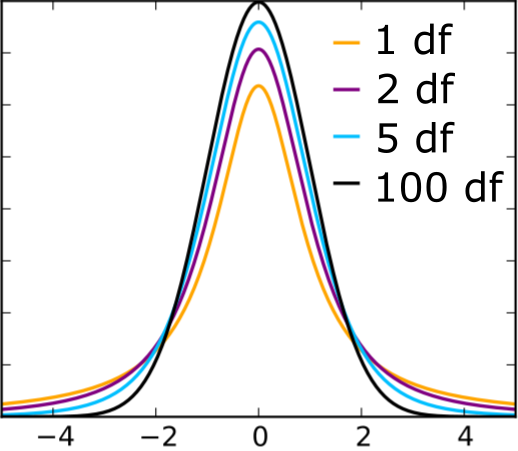

## Agenda

* HW 2 will be returned soon
    * Please make sure to look at Johe's comments
    * Contact Johe if you have any questions
* Optional extension to HW 3 or Lab 4, to Monday (Sept 27) at noon
    * If you take the extension, email me by this Friday
    * If you don't take the extension, you can apply it to a future assignment (hw or lab)
* Quiz on Wednesday. Similar to last time:
    * 15 minutes
    * Open note
    * Covers through Monday Sept 13 (inclusive)
* Today: p-values and confidence intervals

---

## Inference

Is there a relationship between mileage and price for used Honda Accords?

```{r echo=F, message=F, warning=F, fig.align='center', fig.width=6, fig.height=4}
library(tidyverse)
library(Stat2Data)
data("AccordPrice")

AccordPrice %>%
  ggplot(aes(x = Mileage, y = Price)) +
  geom_point(size = 1.5) +
  labs(x = "Mileage (in 1000's)",
       y = "Price (in $1000's)") +
  theme_bw() +
  theme(text = element_text(size = 20))
```

It looks like it, but is that just a fluke?

---

## Is the observed relationship a fluke?

What if the population scatterplot looks like this?

```{r echo=F, message=F, warning=F, fig.align='center', fig.width=6, fig.height=4}

AccordPrice %>%
  ggplot(aes(x = Mileage, y = Price)) +
  geom_point(size = 3) +
  geom_point(aes(x = Mileage, y = Price),
             data = data.frame(Mileage = runif(100, 0, 150),
                   Price = runif(100, 0, 30),
                   type = "Unobserved data"),
             pch = 1, alpha = 0.5, size=3) +
  labs(x = "Mileage (in 1000's)",
       y = "Price (in $1000's)") +
  theme_bw() +
  theme(text = element_text(size = 20))
```

---

## Translating the question

Is there a relationship between mileage and price for used Honda Accords?

```{r echo=F, message=F, warning=F, fig.align='center', fig.width=6, fig.height=4}

AccordPrice %>%
  ggplot(aes(x = Mileage, y = Price)) +
  geom_point(size = 1.5) +
  labs(x = "Mileage (in 1000's)",
       y = "Price (in $1000's)") +
  theme_bw() +
  theme(text = element_text(size = 20))
```

**Model:** $\text{price} = \beta_0 + \beta_1 \text{mileage} + \varepsilon$

**Estimated line:** $\widehat{\text{price}} = 20.8 - 0.12 \ \text{mileage}$

**Question:** Is $\beta_1 = 0$?

---

## Inference

**Model:** $\text{price} = \beta_0 + \beta_1 \text{mileage} + \varepsilon$

**Estimated line:** $\widehat{\text{price}} = 20.8 - 0.12 \ \text{mileage}$

**Question:** Is $\beta_1 = 0$?

**Hypotheses:**
.center[
$H_0: \beta_1 = 0$ 

$H_A: \beta_1 \neq 0$
]

.question[
If $\beta_1 = 0$, how unusual would $\widehat{\beta}_1 = -0.12$ be?
]

--

Need to know:
* Variability of $\widehat{\beta}_1$ from sample to sample
* Sampling distribution of $\widehat{\beta}_1$

---

## How unusual is the observed slope?

**Standardize:** $\ \ \ \ t = \dfrac{\widehat{\beta}_1}{SE_{\widehat{\beta}_1}}$

where $SE_{\widehat{\beta}_1}$ is the estimated standard error (standard deviation) of $\widehat{\beta}_1$

--

**Accord data:**

```{r, eval=F}
accord_lm <- lm(Price ~ Mileage, data = AccordPrice)
summary(accord_lm)
```

.center[

]

---

## How unusual is the observed slope?

**Standardize:** $\ \ \ \ t = \dfrac{\widehat{\beta}_1}{SE_{\widehat{\beta}_1}}$

where $SE_{\widehat{\beta}_1}$ is the estimated standard error (standard deviation) of $\widehat{\beta}_1$

**Accord data:**

```{r, eval=F}
accord_lm <- lm(Price ~ Mileage, data = AccordPrice)
summary(accord_lm)
```

.center[

]

.center[
$t = \dfrac{-0.12}{0.014} = -8.5$
]

---

## How unusual is the observed slope?

.center[
$t = \dfrac{\widehat{\beta}_1}{SE_{\widehat{\beta}_1}}$
]

If $\beta_1 = 0$, then $t$ follows a $t$-distribution with $n-2$ degrees of freedom (df)

.center[
<ins>t-distributions</ins>


]

---

## How unusual is the observed slope?

$t = \dfrac{-0.12}{0.014} = -8.5$, $\ \ \ \ n - 2 = 28$

$t_{28}$ distribution:

```{r echo=F, fig.align='center', fig.width=6, fig.height=4}
data.frame(x = seq(-10, 10, 0.1),
           y = dt(seq(-10, 10, 0.1), 
                  28)) %>%
  ggplot(aes(x = x, y = y)) +
  geom_line(lwd = 1.5) +
  labs(x = "", y = "density") +
  geom_vline(xintercept = c(-8.5, 8.5),
             lwd = 1.5) +
  theme_minimal() +
  theme(text = element_text(size = 20)) +
  scale_x_continuous(breaks=c(-8.5, 0, 8.5))
```

---

## How unusual is the observed slope?

```{r echo=F, fig.align='center', fig.width=6, fig.height=4}
data.frame(x = seq(-10, 10, 0.1),
           y = dt(seq(-10, 10, 0.1), 
                  28)) %>%
  ggplot(aes(x = x, y = y)) +
  geom_line(lwd = 1.5) +
  labs(x = "", y = "density") +
  geom_vline(xintercept = c(-8.5, 8.5),
             lwd = 1.5) +
  theme_minimal() +
  theme(text = element_text(size = 20)) +
  scale_x_continuous(breaks=c(-8.5, 0, 8.5))
```

.question[
What fraction of the time do we see $t < -8.5$ or $t > 8.5$?
]

--

```{r}
pt(-8.5, df=28, lower.tail = TRUE) + 
  pt(8.5, df=28, lower.tail = FALSE)
```

---

## How unusual is the observed slope?

```{r echo=F, fig.align='center', fig.width=6, fig.height=4}
data.frame(x = seq(-10, 10, 0.1),
           y = dt(seq(-10, 10, 0.1), 
                  28)) %>%
  ggplot(aes(x = x, y = y)) +
  geom_line(lwd = 1.5) +
  labs(x = "", y = "density") +
  geom_vline(xintercept = c(-8.5, 8.5),
             lwd = 1.5) +
  theme_minimal() +
  theme(text = element_text(size = 20)) +
  scale_x_continuous(breaks=c(-8.5, 0, 8.5))
```

```{r}
pt(-8.5, df=28, lower.tail = TRUE) + 
  pt(8.5, df=28, lower.tail = FALSE)
```

.question[
*If* $\beta_1 = 0$, the probability of observing $t < -8.5$ or $t > 8.5$ is approximately $0.0000000003$
]

---

## How unusual is the observed slope?

```{r echo=F, fig.align='center', fig.width=6, fig.height=4}
data.frame(x = seq(-10, 10, 0.1),
           y = dt(seq(-10, 10, 0.1), 
                  28)) %>%
  ggplot(aes(x = x, y = y)) +
  geom_line(lwd = 1.5) +
  labs(x = "", y = "density") +
  geom_vline(xintercept = c(-8.5, 8.5),
             lwd = 1.5) +
  theme_minimal() +
  theme(text = element_text(size = 20)) +
  scale_x_continuous(breaks=c(-8.5, 0, 8.5))
```

.question[
*If* $\beta_1 = 0$, the probability of observing $t < -8.5$ or $t > 8.5$ is approximately $0.0000000003$
]

*p-value* = $0.000000003$

---

## Putting it together

Is there a relationship between mileage and price for used Honda Accords?

**Model:** $\text{price} = \beta_0 + \beta_1 \text{mileage} + \varepsilon$

**Estimated line:** $\widehat{\text{price}} = 20.8 - 0.12 \ \text{mileage}$

**Question:** Is $\beta_1 = 0$?

**Hypotheses:**
.center[
$H_0: \beta_1 = 0$ 

$H_A: \beta_1 \neq 0$
]

**Test statistic:** $\ \ \ \ t = \dfrac{\widehat{\beta}_1}{SE_{\widehat{\beta}_1}} = \dfrac{-0.12}{0.014} = -8.5$

**p-value:** 0.000000003

**Conclusion:** The observed slope of -0.12 would be <ins>very</ins> unusual if there were no relationship between mileage and price for used Honda Accords, so we have strong evidence that there is a relationship between mileage and price.

---

## In R

```{r, eval=F}
accord_lm <- lm(Price ~ Mileage, data = AccordPrice)
summary(accord_lm)
```

.center[

]

---

## Interpreting the p-value

* **p-value:** probability of the observed data, or more "extreme" data, if the null hypothesis is true
* measures how *unusual* the observed data are, under $H_0$
* requires model assumptions to be valid

What the p-value is NOT:
* The probability $H_0$ is true
* Proof that $H_0$ is true/false

---

## Confidence intervals for the slope

.question[
What is a "reasonable" range of possible values for $\beta_1$, given the observed data?
]

--

**Confidence interval:**

.center[
$\widehat{\beta}_1 \ \pm \ t^* SE_{\widehat{\beta}_1}$
]

where $t^*$ = critical value of $t_{n-2}$ distribution

---

## $t^*$

What is $t^*$ for a 95% confidence interval?

.center[

]

---

## In R

Accord data: $n - 2 = 28$

.center[

]

```{r}
qt(0.025, df=28, lower.tail=F)
```

$t^* = 2.05$

---

## $t^*$

What is $t^*$ for a 90% confidence interval?

.center[

]

```{r}
qt(0.05, df=28, lower.tail=F)
```

$t^* = 1.7$

---

## Calculating confidence intervals

.center[
$\widehat{\beta}_1 \ \pm \ t^* SE_{\widehat{\beta}_1}$
]

```{r, eval=F}
accord_lm <- lm(Price ~ Mileage, data = AccordPrice)
summary(accord_lm)
```

.center[

]

95% CI: [-0.149, -0.091]

```{r}
-0.12 - 2.05*0.014
-0.12 + 2.05*0.014
```

---

## Calculating confidence intervals

.center[
$\widehat{\beta}_1 \ \pm \ t^* SE_{\widehat{\beta}_1}$
]

```{r, eval=F}
accord_lm <- lm(Price ~ Mileage, data = AccordPrice)
summary(accord_lm)
```

.center[

]

95% CI: [-0.149, -0.091]

We are 95% confidence that as mileage increases by 1000 miles, the average price decreases between `$91` and `$149` in the population of all used Accords.

---

## Understanding confidence intervals

* If I collect many datasets, with my model assumptions met, and calculate a 95% CI for each one, then I expect 95% of my CIs to contain the corresponding $\beta_1$
* requires model assumptions to be valid

Wrong interpretation:
* there is a 95% probability that $\beta_1$ is in [-0.149, -0.091]

---

## Class activity

[https://sta112-f21.github.io/class_activities/ca_lecture_13.html](https://sta112-f21.github.io/class_activities/ca_lecture_13.html)
