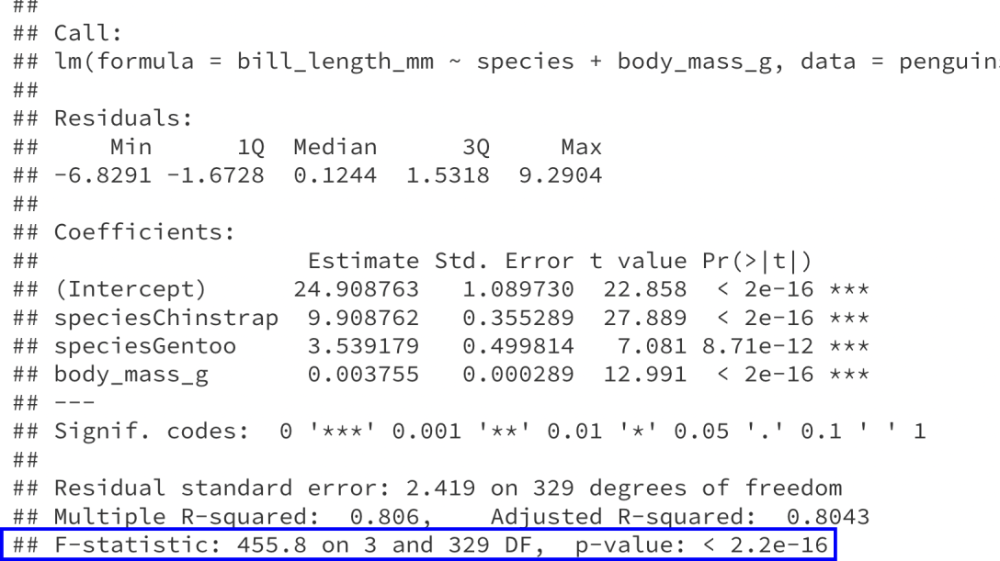

## Agenda

---

## Relationships between > 2 variables

```{r echo=F, message=F, warning=F, fig.align='center', fig.width=8, fig.height=5}
library(tidyverse)
library(palmerpenguins)

penguins %>%
  drop_na() %>%
  ggplot(aes(x = body_mass_g,
             y = bill_length_mm,
             color = species)) +
  geom_point(size = 2) +
  labs(x = "Body mass (g)",
       y = "Bill length (mm)",
       color = "Species") +
  theme_bw() +
  theme(text = element_text(size = 20))
```

.question[
How can we model the relationship between body mass, species, and bill length?
]

---

### Regression with a single quantitative predictor

```{r echo=F, message=F, warning=F, fig.align='center', fig.width=6, fig.height=4}

penguins %>%
  drop_na() %>%
  ggplot(aes(x = body_mass_g,
             y = bill_length_mm)) +
  geom_point() +
  labs(x = "Body mass (g)",
       y = "Bill length (mm)") +
  theme_bw() +
  theme(text = element_text(size = 20))
```

**Model:**

.center[
$\text{bill length} = \beta_0 + \beta_1 \text{body mass} + \varepsilon$
]

---

### Regression with a single categorical predictor

```{r echo=F, message=F, warning=F, fig.align='center', fig.width=6, fig.height=4}

penguins %>%
  drop_na() %>%
  ggplot(aes(x = species,
             y = bill_length_mm)) +
  geom_boxplot() +
  labs(x = "Species",
       y = "Bill length (mm)") +
  theme_bw() +
  theme(text = element_text(size = 20))
```

**Model:**

.center[
$\text{bill length} = \beta_0 + \beta_1 \text{IsChinstrap} + \beta_2 \text{IsGentoo} + \varepsilon$
]

---

## Multiple regression

```{r echo=F, message=F, warning=F, fig.align='center', fig.width=7, fig.height=4.5}

penguins_no_nas <- penguins %>%
  drop_na()

length_lm <- lm(bill_length_mm ~ species + body_mass_g, 
                data = penguins_no_nas)

penguins_no_nas %>%
  mutate(yhat = predict(length_lm)) %>%
  ggplot(aes(x = body_mass_g,
             y = bill_length_mm,
             color = species)) +
  geom_point(size = 2, alpha = 0.5) +
  geom_line(aes(y = yhat), 
            lwd = 1.5) +
  labs(x = "Body mass (g)",
       y = "Bill length (mm)",
       color = "Species") +
  theme_bw() +
  theme(text = element_text(size = 20))
```

**Model:**

.center[
$\text{bill length} = \beta_0 + \beta_1 \text{IsChinstrap} + \beta_2 \text{IsGentoo} + \beta_3 \text{body mass} + \varepsilon$
]

**Estimated model:**

.center[
$\widehat{\text{bill length}} = 24.91 + 9.91 \ \text{IsChinstrap} + 3.54 \ \text{IsGentoo} + 0.0038 \ \text{body mass}$
]

---

## Interpreting regression coefficients

.center[
$\widehat{\text{bill length}} = 24.91 + 9.91 \ \text{IsChinstrap} + 3.54 \ \text{IsGentoo} + 0.0038 \ \text{body mass}$
]

* $24.91 =$ predicted bill length of Adelie penguins when body mass is 0 g
* $24.91 + 9.91 = 34.82 =$ predicted bill length of Chinstrap penguins when body mass is 0 g
* $24.91 + 3.54 = 28.45 =$ predicted bill length of Gentoo penguins when body mass is 0 g
* $0.0038 =$ average change in bill length associated with an increase of 1g in body mass, holding species constant

---

## Interpreting regression coefficients

```{r echo=F, message=F, warning=F, fig.align='center', fig.width=7, fig.height=4.5}
library(latex2exp)
penguins_no_nas %>%
  mutate(yhat = predict(length_lm)) %>%
  ggplot(aes(x = body_mass_g,
             y = bill_length_mm)) +
  geom_point(size = 2, alpha = 0) +
  geom_line(aes(y = yhat, color = species), 
            lwd = 1.5) +
  labs(x = "Body mass (g)",
       y = "Bill length (mm)",
       color = "Species") +
  geom_segment(aes(x = 3500, y = 38,
                   xend = 3500, yend = 48),
               arrow = arrow(length = unit(0.3, "cm"))) +
  geom_segment(aes(x = 4500, y = 42,
                   xend = 4500, yend = 45),
               arrow = arrow(length = unit(0.3, "cm"))) +
  annotate("text", x = 3000, y = 41, 
           label = TeX("$9.91", output='character'), 
           parse=TRUE, size = 7) +
  annotate("text", x = 5000, y = 44, 
           label = TeX("$3.54", output='character'), 
           parse=TRUE, size = 7) +
  theme_bw() +
  theme(text = element_text(size = 20))
```

.center[
$\widehat{\text{bill length}} = 24.91 + 9.91 \ \text{IsChinstrap} + 3.54 \ \text{IsGentoo} + 0.0038 \ \text{body mass}$
]

* $9.91 =$ estimated mean difference in bill length for a Chinstrap and Adelie penguin with the same body mass
* $3.54 =$ estimated mean difference in bill length for a Gentoo and Adelie penguin with the same body mass

---

## In R

```{r}
lm(bill_length_mm ~ species + body_mass_g, data = penguins_no_nas)
```

.center[
$\widehat{\text{bill length}} = 24.91 + 9.91 \ \text{IsChinstrap} + 3.54 \ \text{IsGentoo} + 0.0038 \ \text{body mass}$
]

---

## Concept check

.center[
$\widehat{\text{bill length}} = 24.91 + 9.91 \ \text{IsChinstrap} + 3.54 \ \text{IsGentoo} + 0.0038 \ \text{body mass}$
]

True or False: the fitted regression lines for Adelies, Chinstraps, and Gentoos are all parallel.

.abox[
True
]

.dbox[
False
]

---

## Concept check

.center[
$\widehat{\text{bill length}} = 24.91 + 9.91 \ \text{IsChinstrap} + 3.54 \ \text{IsGentoo} + 0.0038 \ \text{body mass}$
]

True or False: the fitted regression lines for Adelies, Chinstraps, and Gentoos are all parallel.

.abox[
True
]

.dbox[
False
]

**Solution:** True. The slope (0.0038) of the regression line is the same for each species. The only thing we have changed is the intercept.

---

## Concept check

.center[
$\widehat{\text{bill length}} = 24.91 + 9.91 \ \text{IsChinstrap} + 3.54 \ \text{IsGentoo} + 0.0038 \ \text{body mass}$
]

What is the estimated difference in bill length for Chinstrap and Gentoo penguins with the same body mass?

.abox[
24.91
]

.bbox[
9.91
]

.cbox[
3.54
]

.dbox[
6.37
]

---

## Concept check

.center[
$\widehat{\text{bill length}} = 24.91 + 9.91 \ \text{IsChinstrap} + 3.54 \ \text{IsGentoo} + 0.0038 \ \text{body mass}$
]

What is the estimated difference in bill length for Chinstrap and Gentoo penguins with the same body mass?

.abox[
24.91
]

.bbox[
9.91
]

.cbox[
3.54
]

.dbox[
6.37
]

**Solution:** 6.37 = 9.91 - 3.54

---

## Concept check

.center[
$\widehat{\text{bill length}} = 24.91 + 9.91 \ \text{IsChinstrap} + 3.54 \ \text{IsGentoo} + 0.0038 \ \text{body mass}$
]

What is the predicted bill length for a Gentoo penguin with a body mass of 5000 g?

.abox[
19 mm
]

.bbox[
43.91 mm
]

.cbox[
47.45 mm
]

.dbox[
53.82 mm
]

---

## Concept check

.center[
$\widehat{\text{bill length}} = 24.91 + 9.91 \ \text{IsChinstrap} + 3.54 \ \text{IsGentoo} + 0.0038 \ \text{body mass}$
]

What is the predicted bill length for a Gentoo penguin with a body mass of 5000 g?

.abox[
19 mm
]

.bbox[
43.91 mm
]

.cbox[
47.45 mm
]

.dbox[
53.82 mm
]

**Solution:** $47.45 = 24.91 + 3.54 + 0.0038(5000)$

---

## Model assumptions

**Model:**

.center[
$\text{bill length} = \beta_0 + \beta_1 \text{IsChinstrap} + \beta_2 \text{IsGentoo} + \beta_3 \text{body mass} + \varepsilon$
]

where $\varepsilon \sim N(0, \sigma_{\varepsilon}^2)$ and the $\varepsilon$ are independent of each other.

**Assumptions:**

* Shape (whenever we have at least quantitative predictor)
* Constant variance
* Independence
* Randomness
* Zero mean
* Normality

---

## Checking assumptions

.pull-left[
Residual plot:

```{r echo=F, fig.align='center', fig.width=6, fig.height=4}
penguins_no_nas %>%
  mutate(resids = residuals(length_lm),
         yhat = predict(length_lm)) %>%
  ggplot(aes(x = yhat, y = resids)) +
  geom_point(size = 1.5) +
  geom_abline(slope = 0, intercept = 0, 
              color = "blue", lwd = 1.2) +
  labs(x = "Predicted bill length (mm)",
       y = "Residuals") +
  theme_bw() +
  theme(text = element_text(size = 20))
```
]

.pull-right[
QQ plot:

```{r echo=F, fig.align='center', fig.width=6, fig.height=4}
penguins_no_nas %>%
  mutate(resids = residuals(length_lm)) %>%
  ggplot(aes(sample = resids)) +
  geom_qq() +
  geom_qq_line() +
  labs(x = "Theoretical normal quantiles",
       y = "Observed residual quantiles") +
  theme_bw() +
  theme(text = element_text(size = 20))
```
]

The shape, constant variance, and normality assumptions all look reasonable.

---

## Some inference questions

* Is there any relationship between the predictors (species and body mass) and the response (bill length)?
* After accounting for species, is there a relationship between body mass and bill length?
* After accounting for body mass, is there a relationship between species and bill length?

---

## Question

.pull-left[
From the scatterplot, it looks like we want the model to include both species <ins>and</ins> body mass:

```{r echo=F, message=F, warning=F, fig.align='center', fig.width=6, fig.height=4}

penguins %>%
  drop_na() %>%
  ggplot(aes(x = body_mass_g,
             y = bill_length_mm,
             color = species)) +
  geom_point(size = 2) +
  labs(x = "Body mass (g)",
       y = "Bill length (mm)",
       color = "Species") +
  theme_bw() +
  theme(text = element_text(size = 20))
```
]

.pull-right[
But other potential relationships could have occurred. Work in groups to answer the following question.

Draw two different scatterplots, representing two different scenarios:

* **Scenario 1:** There appears to be a relationship between body mass and bill length, but it goes away after we account for species.
* **Scenario 2:** There appears to be a relationship between species and bill length, but it goes away after we account for body mass.
]

---

## Scenario 1

**Scenario 1:** There appears to be a relationship between body mass and bill length, but it goes away after we account for species.

There are many possibilities. Here is one (note that this example is completely made up):

```{r, echo=F, fig.align='center', fig.width=6, fig.height=4}
data.frame(species = rep(c("Adelie", "Chinstrap", "Gentoo"),
                         each = 200),
           bill_length = rnorm(600, sd=2) + rep(c(30, 40, 50),
                                          each = 200),
           body_mass = rnorm(600, sd=200) + 
             rep(c(3000, 4000, 5000), each=200)) %>%
  ggplot(aes(x = body_mass, 
             y = bill_length,
             color = species)) +
  geom_point() +
  labs(x = "Body mass (g)",
       y = "Bill length (mm)",
       color = "Species") +
  theme_bw() +
  theme(text = element_text(size = 20))
```

---

## Scenario 2

**Scenario 2:** There appears to be a relationship between species and bill length, but it goes away after we account for body mass.

There are many possibilities. Here is one (note that this example is completely made up):

```{r, echo=F, fig.align='center', fig.width=7, fig.height=5}
x = c(rnorm(200, 3000, 300),
      rnorm(200, 4000, 300),
      rnorm(200, 5000, 300))

data.frame(species = rep(c("Adelie", "Chinstrap", "Gentoo"),
                         each = 200),
           body_mass = x,
           bill_length = 25 + 0.0038*x + rnorm(600, sd=1)) %>%
  ggplot(aes(x = body_mass, 
             y = bill_length,
             color = species)) +
  geom_point() +
  labs(x = "Body mass (g)",
       y = "Bill length (mm)",
       color = "Species") +
  theme_bw() +
  theme(text = element_text(size = 20))
```

---

## Translating inference questions into hypotheses

**Model:**

.center[
$\text{bill length} = \beta_0 + \beta_1 \text{IsChinstrap} + \beta_2 \text{IsGentoo} + \beta_3 \text{body mass} + \varepsilon$
]

* Is there any relationship between the predictors (species and body mass) and the response (bill length)?

.center[
$H_0: \beta_1 = \beta_2 = \beta_3 = 0  \hspace{2cm} H_A: \text{at least one of } \beta_1, \beta_2, \beta_3 \neq 0$
]

--

* After accounting for species, is there a relationship between body mass and bill length?

.center[
$H_0: \beta_3 = 0  \hspace{2cm} H_A: \beta_3 \neq 0$
]

--

* After accounting for body mass, is there a relationship between species and bill length?

--

.center[
$H_0: \beta_1 = \beta_2 = 0  \hspace{2cm} H_A: \text{at least one of } \beta_1, \beta_2 \neq 0$
]

---

## Testing hypotheses


**Model:** $\ \ \text{bill length} = \beta_0 + \beta_1 \text{IsChinstrap} + \beta_2 \text{IsGentoo} + \beta_3 \text{body mass} + \varepsilon$

**Hypotheses:**
.center[
$H_0: \beta_1 = \beta_2 = \beta_3 = 0$ 

$H_A: \text{at least one of } \beta_1, \beta_2, \beta_3 \neq 0$
]

**Reduced model ( $H_0$ ):** $\ \text{bill length} = \beta_0 + \varepsilon$

**Full model ( $H_A$ ):** $\ \text{bill length} = \beta_0 + \beta_1 \text{IsChinstrap} + \beta_2 \text{IsGentoo} + \beta_3 \text{body mass} + \varepsilon$

--

**Intuition:** Evidence against $H_0$ when predictions for full model are "much closer" to the observed responses

--

**Test statistic:** $\ F = \dfrac{\frac{1}{\text{# parameters tested}} (SSE_{reduced} - SSE_{full})}{\frac{1}{n - p} SSE_{full}} \hspace{0.5cm} p = \text{total # parameters}$

**Distribution:** $\ F_{\text{# parameters tested}, \ n - p} \hspace{1cm}$ under $H_0$

---

## In practice

**Full model:**

```{r}
length_lm_full <- lm(bill_length_mm ~ species + body_mass_g,
                     data = penguins_no_nas)
anova(length_lm_full)
```

$SSE_{full} = 1925.7$

$n - p = 329$

---

## In practice

**Reduced model:**

```{r}
length_lm_reduced <- lm(bill_length_mm ~ 1,
                     data = penguins_no_nas)
anova(length_lm_reduced)
```

$SSE_{reduced} = 9928.9$

$\text{# parameters tested} = 3$

---

## In practice

**Model:** $\ \ \text{bill length} = \beta_0 + \beta_1 \text{IsChinstrap} + \beta_2 \text{IsGentoo} + \beta_3 \text{body mass} + \varepsilon$

**Hypotheses:**
.center[
$H_0: \beta_1 = \beta_2 = \beta_3 = 0$ 

$H_A: \text{at least one of } \beta_1, \beta_2, \beta_3 \neq 0$
]

* $SSE_{full} = 1925.7$
* $SSE_{reduced} = 9928.9$
* $n - p = 329$
* $\text{# parameters tested} = 3$

**Test statistic:** $\ F = \dfrac{(9928.9 - 1925.7)/3}{1925.7/329} = 455.8$

**Distribution:** Under $H_0$, the $F$-statistic comes from an $F_{3, 329}$ distribution

**p-value:** $\ \approx 0$

---

### Intercept-only reduced model is a special case

```{r}
length_lm <- lm(bill_length_mm ~ species + body_mass_g, data = penguins_no_nas)
summary(length_lm)
```

---

### Intercept-only reduced model is a special case

```{r, eval=F}
length_lm <- lm(bill_length_mm ~ species + body_mass_g, data = penguins_no_nas)
summary(length_lm)
```

.center[

]