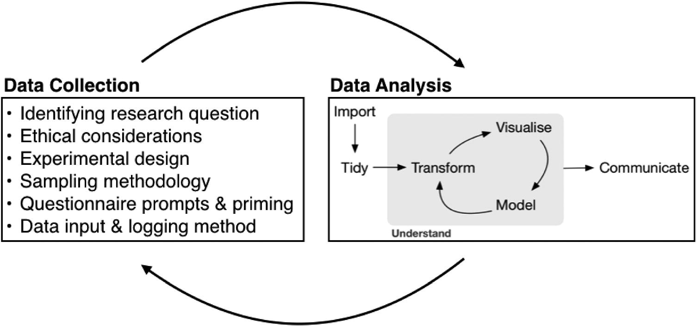
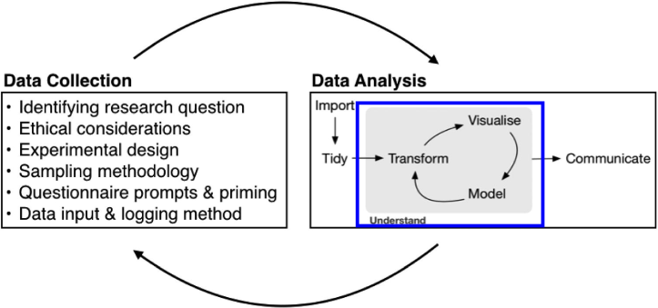
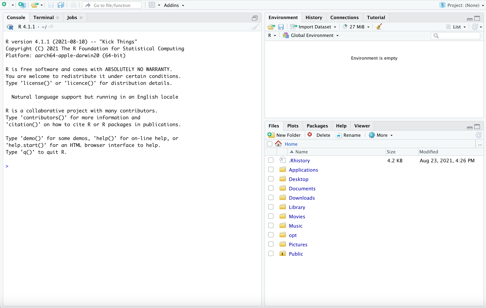
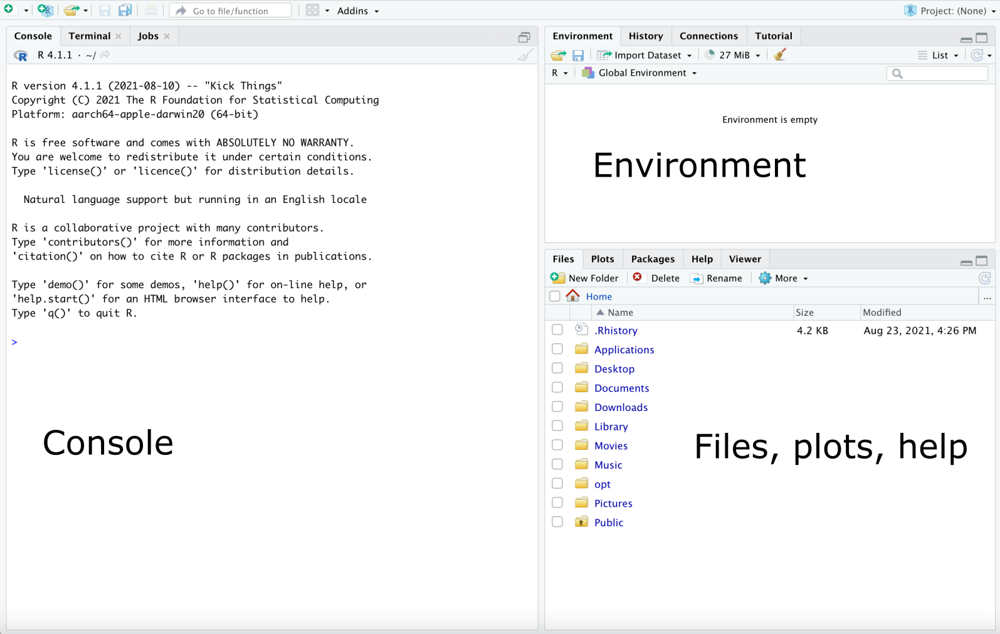
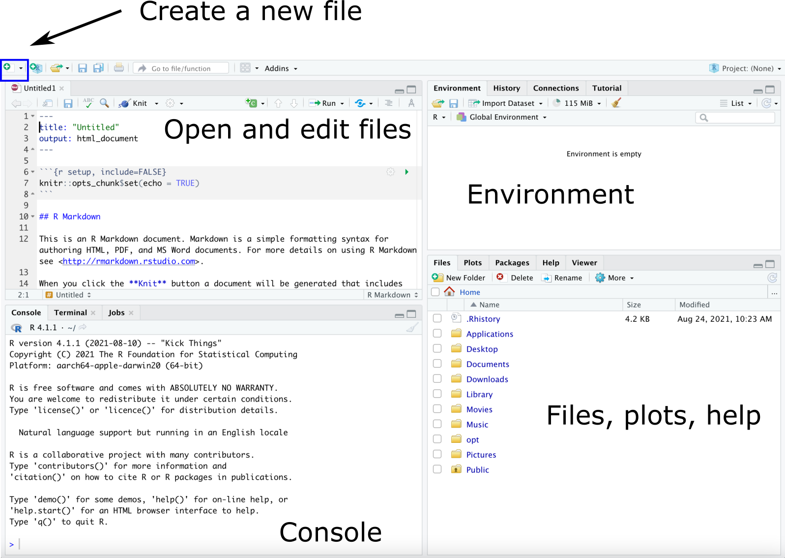

## Agenda

* Overview of exploratory data analysis
* Introduction to R and RStudio
* Class activity: penguins!

---

## The data analysis process

.center[

]

---

## The data analysis process

.center[

]

--

*Understanding*:
* Not a linear process
* Begins with *exploratory data analysis*

---

## Exploratory data analysis (EDA)

.center[

]

Goal: get familiar with the data

* What does the data represent?
    * How big is the data?
    * What are the rows and columns?
    * Where and when was it collected?
    * Who collected it, and what choices did they make?
    * Etc.

---

## Exploratory data analysis (EDA)

.center[

]

Goal: get familiar with the data

* What do the variables look like? (univariate EDA)
    * histograms, frequency tables, summary statistics, etc.
    * any outliers?
    
---

## Exploratory data analysis (EDA)

.center[

]

Goal: get familiar with the data

* How are the variables related? (multivariate EDA)
    * two-way tables, scatterplots, boxplots, etc.
    
---
    
## Exploratory data analysis (EDA)

.center[

]

Goal: get familiar with the data

* What relationships might we want to model?
    * generally informed by *why* we're looking at the data
    
---

## Tools for working with data

**R:** Statistical software for data manipulation, visualization, computing, modeling

**RStudio:** Integrated development environment (IDE) that makes it easy to use R

.center[

]

.footnote[
Source: [Modern Dive](https://moderndive.com/index.html)
]

---

## Overview of RStudio

.center[

]

---

## Panes

.center[

]

---

## Panes

.center[

]

---

## Class activity: EDA with penguins

[https://sta112-f21.github.io/class_activities/ca_lecture2.html](https://sta112-f21.github.io/class_activities/ca_lecture2.html)

.center[

]

.footnote[
Artwork by @allison_horst
]

---

```{r setup, include=FALSE}
knitr::opts_chunk$set(echo = TRUE, warning=F, message=F)
library(palmerpenguins)
library(tidyverse)
```

## Distribution of bill length

```{r, fig.width = 8, fig.height=5}
penguins %>%
  ggplot(aes(x = bill_length_mm)) +
  geom_histogram()
```

---

## Distribution of bill length

```{r, fig.width = 8, fig.height=5, echo=F}
penguins %>%
  ggplot(aes(x = bill_length_mm)) +
  geom_histogram()
```

* Most bill lengths between 35mm and 55mm
* Multimodal, with peaks around 40mm, 45mm, and 50mm
* Fairly symmetric, no clear outliers

---

## Aside: changing the number of bins

```{r, fig.width = 6, fig.height=4}
penguins %>%
  ggplot(aes(x = bill_length_mm)) +
  geom_histogram(bins = 20)
```

When making histograms, it is good to try different numbers of bins. The default in `geom_histogram` is 30, but can be changed with `bins = ...`

---

## Bill depth vs. bill length

```{r, fig.width = 6, fig.height = 4}
penguins %>%
  ggplot(aes(x = bill_length_mm, y = bill_depth_mm)) +
  geom_point()
```

---

## Bill depth vs. bill length

```{r, fig.width = 7, fig.height = 5, echo = F}
penguins %>%
  ggplot(aes(x = bill_length_mm, y = bill_depth_mm)) +
  geom_point()
```

* There does not appear to be a relationship between bill length and bill depth

---

## Coloring by species

```{r, fig.width = 7, fig.height = 4}
penguins %>%
  ggplot(aes(x = bill_length_mm, y = bill_depth_mm, 
             color = species)) +
  geom_point()
```

Within each species, there appears to be a positive, linear relationship between bill length and bill depth.

---

## Predicting species

```{r, fig.width = 7, fig.height = 5, echo=F, fig.align='center'}
penguins %>%
  ggplot(aes(x = bill_length_mm, y = bill_depth_mm, 
             color = species)) +
  geom_point()
```

New penguin 🐧:
* Bill length = 50mm, bill depth = 15mm
* Predicted species = ?

---

## Prediction function

```{r, fig.width = 7, fig.height = 5, echo=F, fig.align='center'}
penguins %>%
  ggplot(aes(x = bill_length_mm, y = bill_depth_mm, 
             color = species)) +
  geom_point()
```

---

## Prediction function

```{r, fig.width = 7, fig.height = 5, echo=F, fig.align='center'}
penguins %>%
  ggplot(aes(x = bill_length_mm, y = bill_depth_mm, 
             color = species)) +
  geom_point() +
  geom_segment(aes(x = 30, y = 16.25, xend = 60, yend = 16.25),
               color = "black") +
  geom_segment(aes(x = 45, y = 16.25, xend = 45, yend = 21.5),
               color = "black")
```

$f(length, depth) = \begin{cases} \text{Gentoo}, \ depth < 16.25mm \\ \text{Adelie}, \ depth > 16.25mm \text{ and } length < 45mm \\ \text{Chinstrap}, \ depth > 16.25mm \text{ and } length > 45mm \end{cases}$