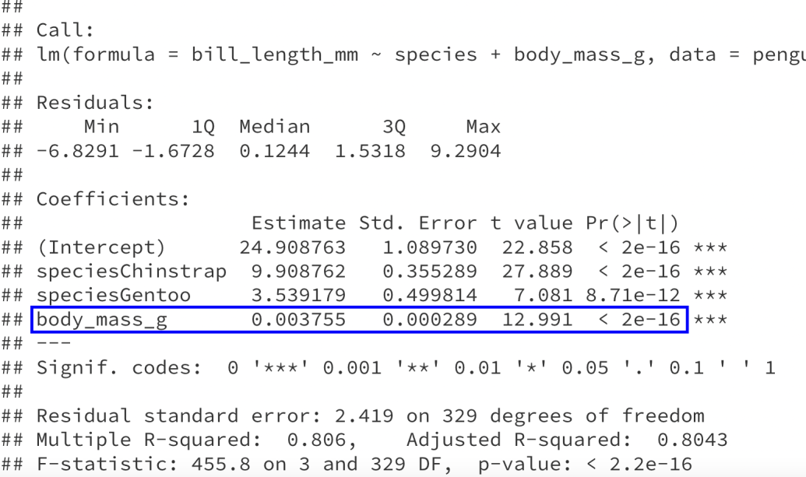

## Agenda

* No class this Friday (fall break)
* Update to final project -- no in-person component during final exam slot
* Today: 
    * comparing models with nested F tests
    * Quiz 3

---

## Recap

```{r echo=F, message=F, warning=F, fig.align='center', fig.width=8, fig.height=5}
library(tidyverse)
library(palmerpenguins)

penguins_no_nas <- penguins %>%
  drop_na()

penguins_no_nas %>%
  ggplot(aes(x = body_mass_g,
             y = bill_length_mm,
             color = species)) +
  geom_point(size = 2) +
  labs(x = "Body mass (g)",
       y = "Bill length (mm)",
       color = "Species") +
  theme_bw() +
  theme(text = element_text(size = 20))
```

---

## Recap

**Model:**

.center[
$\text{bill length} = \beta_0 + \beta_1 \text{IsChinstrap} + \beta_2 \text{IsGentoo} + \beta_3 \text{body mass} + \varepsilon$
]

--

* Is there any relationship between the predictors (species and body mass) and the response (bill length)?

.center[
$H_0: \beta_1 = \beta_2 = \beta_3 = 0  \hspace{2cm} H_A: \text{at least one of } \beta_1, \beta_2, \beta_3 \neq 0$
]

--

* After accounting for species, is there a relationship between body mass and bill length?

.center[
$H_0: \beta_3 = 0  \hspace{2cm} H_A: \beta_3 \neq 0$
]

--

* After accounting for body mass, is there a relationship between species and bill length?


.center[
$H_0: \beta_1 = \beta_2 = 0  \hspace{2cm} H_A: \text{at least one of } \beta_1, \beta_2 \neq 0$
]

---

## Nested F-test


**Model:** $\ \ \text{bill length} = \beta_0 + \beta_1 \text{IsChinstrap} + \beta_2 \text{IsGentoo} + \beta_3 \text{body mass} + \varepsilon$

**Hypotheses:**
.center[
$H_0: \beta_1 = \beta_2 = \beta_3 = 0$ 

$H_A: \text{at least one of } \beta_1, \beta_2, \beta_3 \neq 0$
]

**Reduced model ( $H_0$ ):** $\ \text{bill length} = \beta_0 + \varepsilon$

**Full model ( $H_A$ ):** $\ \text{bill length} = \beta_0 + \beta_1 \text{IsChinstrap} + \beta_2 \text{IsGentoo} + \beta_3 \text{body mass} + \varepsilon$

--

**Intuition:** Evidence against $H_0$ when predictions for full model are "much closer" to the observed responses

--

**Test statistic:** $\ F = \dfrac{\frac{1}{\text{# parameters tested}} (SSE_{reduced} - SSE_{full})}{\frac{1}{n - p} SSE_{full}} \hspace{0.5cm} p = \text{total # parameters}$

**Distribution:** $\ F_{\text{# parameters tested}, \ n - p} \hspace{1cm}$ under $H_0$

---

## In practice

**Full model:**

```{r}
length_lm_full <- lm(bill_length_mm ~ species + body_mass_g,
                     data = penguins_no_nas)
anova(length_lm_full)
```

$SSE_{full} = 1925.7$

$n - p = 329$

---

## In practice

**Reduced model:**

```{r}
length_lm_reduced <- lm(bill_length_mm ~ 1,
                     data = penguins_no_nas)
anova(length_lm_reduced)
```

$SSE_{reduced} = 9928.9$

$\text{# parameters tested} = 3$

---

## In practice

**Model:** $\ \ \text{bill length} = \beta_0 + \beta_1 \text{IsChinstrap} + \beta_2 \text{IsGentoo} + \beta_3 \text{body mass} + \varepsilon$

**Hypotheses:**
.center[
$H_0: \beta_1 = \beta_2 = \beta_3 = 0$ 

$H_A: \text{at least one of } \beta_1, \beta_2, \beta_3 \neq 0$
]

* $SSE_{full} = 1925.7$
* $SSE_{reduced} = 9928.9$
* $n - p = 329$
* $\text{# parameters tested} = 3$

**Test statistic:** $\ F = \dfrac{(9928.9 - 1925.7)/3}{1925.7/329} = 455.8$

**Distribution:** Under $H_0$, the $F$-statistic comes from an $F_{3, 329}$ distribution

**p-value:** $\ \approx 0$, so we have strong evidence that there is some relationship between body mass, species, and bill length.

---

## A little simpler:

```{r}
anova(length_lm_reduced, length_lm_full)
```

---

### Intercept-only reduced model is a special case

**Reduced model ( $H_0$ ):** $\ \text{bill length} = \beta_0 + \varepsilon$

**Full model ( $H_A$ ):** $\ \text{bill length} = \beta_0 + \beta_1 \text{IsChinstrap} + \beta_2 \text{IsGentoo} + \beta_3 \text{body mass} + \varepsilon$

When the reduced model is intercept-only, then

$F = \dfrac{\frac{1}{\text{# parameters tested}} (SSE_{reduced} - SSE_{full})}{\frac{1}{n - p} SSE_{full}} = \dfrac{MSModel_{full}}{MSE_{full}}$

---

### Intercept-only reduced model is a special case

```{r}
length_lm <- lm(bill_length_mm ~ species + body_mass_g, data = penguins_no_nas)
summary(length_lm)
```

---

### Intercept-only reduced model is a special case

```{r, eval=F}
length_lm <- lm(bill_length_mm ~ species + body_mass_g, data = penguins_no_nas)
summary(length_lm)
```

.center[

]

---

## Nested F-test


**Model:** $\ \ \text{bill length} = \beta_0 + \beta_1 \text{IsChinstrap} + \beta_2 \text{IsGentoo} + \beta_3 \text{body mass} + \varepsilon$

**Hypotheses:**
.center[
$H_0: \beta_3 = 0$ 

$H_A: \beta_3 \neq 0$
]

--

**Reduced model ( $H_0$ ):** $\ \text{bill length} = \beta_0 + \beta_1 \text{IsChinstrap} + \beta_2 \text{IsGentoo} + \varepsilon$

**Full model ( $H_A$ ):** $\ \text{bill length} = \beta_0 + \beta_1 \text{IsChinstrap} + \beta_2 \text{IsGentoo} + \beta_3 \text{body mass} + \varepsilon$

--

**Test statistic:** $\ F = \dfrac{\frac{1}{\text{# parameters tested}} (SSE_{reduced} - SSE_{full})}{\frac{1}{n - p} SSE_{full}} \hspace{0.5cm} p = \text{total # parameters}$

**Distribution:** $\ F_{\text{# parameters tested}, \ n - p} \hspace{1cm}$ under $H_0$

---

## In practice

**Reduced model ( $H_0$ ):** $\ \text{bill length} = \beta_0 + \beta_1 \text{IsChinstrap} + \beta_2 \text{IsGentoo} + \varepsilon$

**Full model ( $H_A$ ):** $\ \text{bill length} = \beta_0 + \beta_1 \text{IsChinstrap} + \beta_2 \text{IsGentoo} + \beta_3 \text{body mass} + \varepsilon$

```{r}
length_lm_reduced <- lm(bill_length_mm ~ species,
                     data = penguins_no_nas)
length_lm_full <- lm(bill_length_mm ~ species + body_mass_g,
                     data = penguins_no_nas)
anova(length_lm_reduced, length_lm_full)
```

$F = 168.76$, p-value $\approx 0$, so there is strong evidence for a relationship between body mass and bill length, after accounting for species.

---

### Testing a single parameter is a special case

.center[
$H_0: \beta_i = 0$ 

$H_A: \beta_i \neq 0$
]

When $\text{# parameters tested} = 1$, we can use an $F$-test or a $t$-test:

* $F = \dfrac{\frac{1}{\text{# parameters tested}} (SSE_{reduced} - SSE_{full})}{\frac{1}{n - p} SSE_{full}} = \dfrac{(SSE_{reduced} - SSE_{full})}{\frac{1}{n - p} SSE_{full}}$
* $F$ comes from an $F_{\text{# parameters tested}, \ n-p} = F_{1, \ n-p}$ distribution
* $t = \dfrac{\widehat{\beta}_i}{SE_{\widehat{\beta}_i}}$
* $t$ comes from a $t_{n-p}$ distribution
* $F = t^2$
* The p-values are the same

---

### Testing a single parameter is a special case

```{r}
length_lm_full <- lm(bill_length_mm ~ species + body_mass_g,
                     data = penguins_no_nas)
summary(length_lm_full)
```

---

### Testing a single parameter is a special case

```{r, eval=F}
length_lm_full <- lm(bill_length_mm ~ species + body_mass_g,
                     data = penguins_no_nas)
summary(length_lm_full)
```

.center[

]

$F = 168.76 = 12.991^2 = t^2$

---

## Class Activity

[https://sta112-f21.github.io/class_activities/ca_lecture_20.html](https://sta112-f21.github.io/class_activities/ca_lecture_20.html)