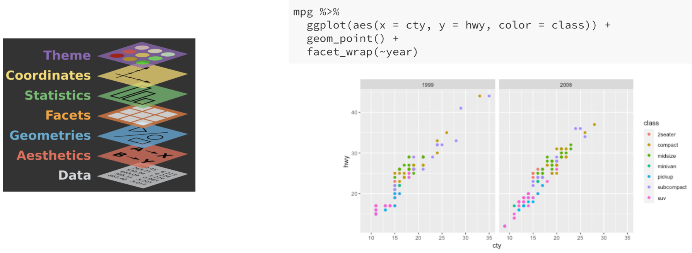
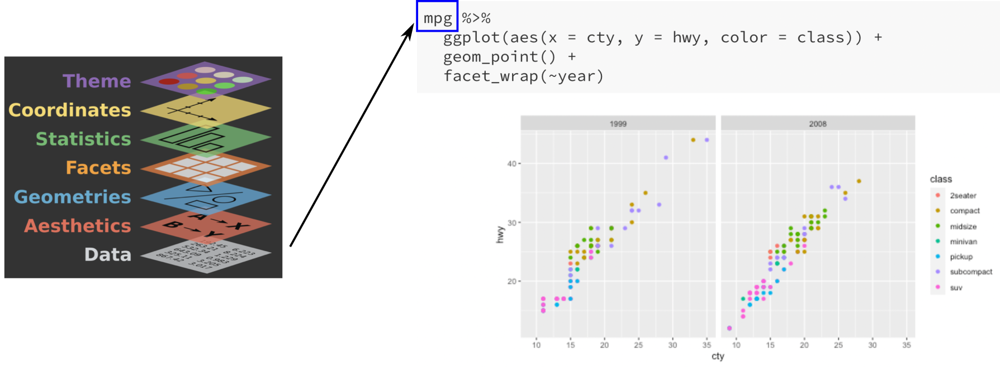
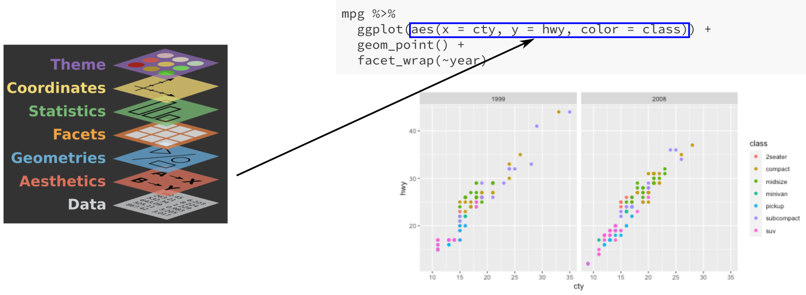
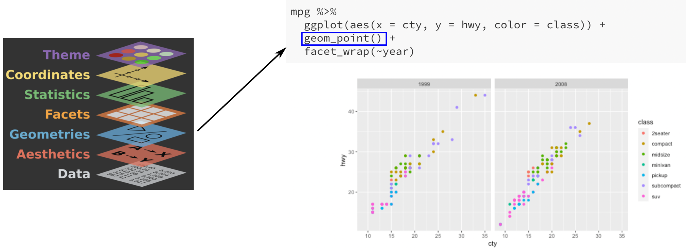
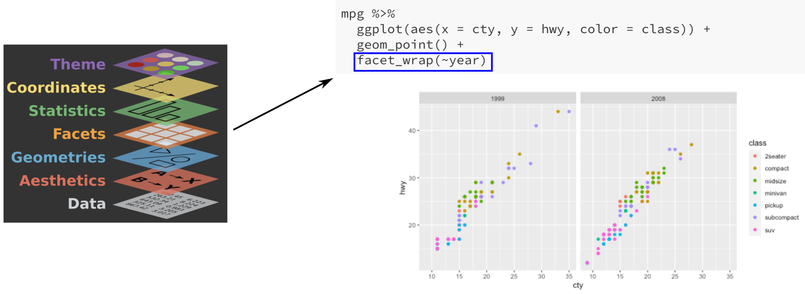

## Announcements

* HW 1 and Lab 1 due on Friday
* Quiz 1 next week (Wednesday September 8)
    - data visualization with ggplot
    - 15--20 minutes in class
    - open-note
    - similar to lab and class activity questions
    
---

## Data for today

```{r, message=F}
library(tidyverse)
glimpse(mpg)
```

---

## Which code created this plot?

```{r, echo=F, fig.width=8, fig.height=6, fig.align='center'}
mpg %>%
  ggplot(aes(x = class, y = hwy)) +
  geom_boxplot()
```

---

## Which code created this plot?

.pull-left[
```{r, echo=F, fig.width=6, fig.height=4, fig.align='center'}
mpg %>%
  ggplot(aes(x = class, y = hwy)) +
  geom_boxplot()
```
]

.pull-right[

.abox[ 
```
mpg %>%
  ggplot(aes(x = class, y = hwy))
```
]

.bbox[
```
mpg %>%
  ggplot(aes(x = hwy, y = class)) +
  geom_boxplot()
```
]

.cbox[
```
mpg %>%
  ggplot(aes(x = hwy)) +
  geom_histogram() +
  facet_wrap(~class)
```
]

.dbox[

```
mpg %>%
  ggplot(aes(x = class, y = hwy)) +
  geom_boxplot()
```

]

]

---

## Which code created this plot?

.pull-left[
```{r, echo=F, fig.width=4, fig.height=6, fig.align='center'}
mpg %>%
  ggplot(aes(x = year, fill = class)) +
  geom_bar()
```
]

.pull-right[

.abox[ 
```
mpg %>%
  ggplot(aes(x = year))
```
]

.bbox[
```
mpg %>%
  ggplot(aes(x = year, fill = class)) +
  geom_bar()
```
]

.cbox[
```
mpg %>%
  ggplot(aes(x = year, color = class)) +
  geom_point()
```
]

.dbox[

```
mpg %>%
  ggplot(aes(x = class)) +
  geom_bar()
```

]

]

---

## Data visualization with ggplot2

* `ggplot2`: the R package
* `ggplot`: the function (from `ggplot2`) used to make plots
* `gg` stands for "Grammar of Graphics"

.center[

]

.footnote[
Artwork by @allison_horst
]

---

## Grammar of Graphics

Build visualizations in layers:

.center[

]

---

## Example

```{r, fig.width = 8, fig.height = 4, fig.align='center'}
mpg %>%
  ggplot(aes(x = cty, y = hwy, color = class)) +
  geom_point() +
  facet_wrap(~year)
```

---

## Data

**Data:** which dataset do we want to visualize?

.center[

]

---

## Data

**Data:** which dataset do we want to visualize?

.center[

]

---

## Aesthetics

**Aes**thetics: mapping features of the plot to variables in the data

.center[

]

---

## Aesthetics

**Aes**thetics: mapping features of the plot to variables in the data

.center[

]


.pull-left[
Examples of aesthetics: 
* `x`
* `y`
* `color`
]

.pull-right[
* `fill`
* `size`
* `shape`
* `opacity` (alpha)
]

---

## Geometric objects

**Geom**etric objects: objects we use to visualize the data

.center[

]

---

## Geometric objects

**Geom**etric objects: objects we use to visualize the data

.center[

]

.pull-left[
Examples of geoms: 
* `geom_point` (scatterplots)
* `geom_line` (line plots)
* `geom_histogram` (histograms)
]

.pull-right[
* `geom_bar` (bar charts)
* `geom_boxplot` (boxplots)
* `geom_smooth` (display regression fits)
* `geom_density` (density plots)
]

---

## Facets

**Facets:** split visualization by the value of another variable

.center[

]

---

## Facets

**Facets:** split visualization by the value of another variable

.center[

]

* `facet_wrap(~year)`: facet the plot by year
* Can also use `facet_grid` to facet by two variables

---

## Theme and appearance

How could this plot be improved? Discuss with a neighbor for 1--2 minutes.

```{r, echo=F, fig.width=8, fig.height=6, fig.align='center'}
mpg %>%
  ggplot(aes(x = class, y = hwy)) +
  geom_boxplot()
```

---

## Theme and appearance

```{r, fig.width=6, fig.height=4, fig.align='center'}
mpg %>%
  ggplot(aes(x = class, y = hwy)) +
  geom_boxplot() +
  labs(x = "Class of car", 
       y = "Highway fuel consumption (miles per gallon)",
       title = "Distribution of highway fuel consumption by class") +
  theme_bw()
```

---

## Theme and appearance

```{r, eval=F}
mpg %>%
  ggplot(aes(x = class, y = hwy)) +
  geom_boxplot() +
  labs(x = "Class of car", 
       y = "Highway fuel consumption (miles per gallon)",
       title = "Distribution of highway fuel consumption by class") +
  theme_bw()
```

* `labs`: specify labels for aesthetics
* themes: customize border, gridlines, background
  - examples: `theme_bw`, `theme_classic`, `theme_minimal`
  
---

## Class activity: practice with ggplot

[https://sta112-f21.github.io/class_activities/ca_lecture_4.html](https://sta112-f21.github.io/class_activities/ca_lecture_4.html)

.center[

]

.footnote[
Artwork by @allison_horst
]

---

## Just because you CAN...

doesn't mean you SHOULD.

.pull-left[
.tiny[
```r
library(palmerpenguins)
penguins %>%
  drop_na() %>%
  ggplot(aes(x = flipper_length_mm, 
             y = body_mass_g,
             color = species,
             shape = sex,
             size = bill_length_mm)) +
  geom_point() +
  facet_wrap(~island) +
  labs(x = "Flipper length (mm)", 
       y = "Body mass (g)",
       color = "Species", 
       shape = "Sex",
       size = "Bill length (mm)") +
  theme_light()
```
]
]

.pull-right[

```{r echo=F, fig.width=6, fig.height=3}
library(palmerpenguins)
penguins %>%
  drop_na() %>%
  ggplot(aes(x = flipper_length_mm, 
             y = body_mass_g,
             color = species,
             shape = sex,
             size = bill_length_mm)) +
  geom_point() +
  facet_wrap(~island) +
  labs(x = "Flipper length (mm)", 
       y = "Body mass (g)",
       color = "Species", 
       shape = "Sex",
       size = "Bill length (mm)") +
  theme_light()
```
]
