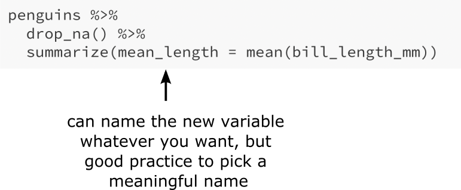

## Agenda

* Reminder: please don't eat or drink in class
* Functions and piping
* Functions for data wrangling
* Class activity

---

## Functions in R

```{r, include=F}
library(palmerpenguins)
library(tidyverse)
```

```{r}
count(penguins)
```

---

## Functions in R

.center[

]

* Functions are typically **verbs** (e.g., `count`, `drop_na`, `ggplot`)
* Functions are applied to the arguments in parentheses

---

## Functions in R

.center[

]

* Functions are typically **verbs** (e.g., `count`, `drop_na`, `ggplot`)
* Functions are applied to the arguments in parentheses
* Additional directions are given as additional arguments

---

## Function arguments

The Help tells you what arguments a function takes:

```r
?count
```

.center[

]

---

## Function arguments

```r
?count
```

.center[

]

---

## Function arguments

```{r}
count(penguins, species, sex, sort = TRUE)
```

---

## Chaining functions together

We can nest functions within other functions:

```{r}
count(drop_na(penguins), species, sex, sort = TRUE)
```

---

## Chaining functions with the pipe

* Nested functions are hard to read (you have to read from the inside out)
* The pipe `%>%` makes it nicer: you can read from top to bottom

.pull-left[
```{r}
count(drop_na(penguins), 
      species, sex, sort=TRUE)
```
]

.pull-right[
```{r}
penguins %>%
  drop_na() %>%
  count(species, sex, sort=TRUE)
```
]

These two chunks are equivalent!

---

## The pipe

Recall that the pipe `%>%` means "and then"

.pull-left[
```r
penguins %>%
  drop_na() %>%
  count(species, sex)
```
]

.pull-right[
take penguins, *and then* <br> drop NAs, *and then* <br>
count by species and sex
]

The output of each line is used as the input for the next line.

---

## Concept check

3 of these 4 code chunks produce the same result. Which one will produce a different result?

.abox[
```
penguins %>%
  drop_na() %>%
  count(species, sex)
```
]

.bbox[
```
penguins_no_nas <- drop_na(penguins)
count(penguins_no_nas, species, sex)
```
]

.cbox[
```
penguins_no_nas <- penguins %>%
  drop_na()
penguins_no_nas %>%
  count(species, sex)
```
]

.dbox[
```
drop_na(penguins)
penguins %>%
  count(species, sex)
```
]

---

## Functions in R (usually) don't modify in place

```r
drop_na(penguins)
```

* returns a *new* data frame with the NAs removed
* the original `penguins` data is unchanged

---

## Data wrangling

.center[

]

.footnote[
Artwork by @allison_horst
]

---

## dplyr for data wrangling

.pull-left[
.center[

]
]

.pull-right[
* part of the tidyverse
* provides a "grammar of data manipulation": useful verbs (functions) for manipulating data
* dplyr functions:
    * are applied to data frames
    * usually return data frames
    * don't modify in place
]

.footnote[
Slides adapted from datasciencebox.org and from material by Dr. Lucy D'Agostino McGowan 
]

---

## A few useful dplyr functions

(A non-exhaustive list)

* `count` (count the number of rows, possibly grouped by variables)
* `arrange` (reorder the rows by the values of one or more variables)
* `filter` (retain a subset of rows that satisfy conditions)
* `select` (select certain columns)
* `distinct` (remove duplicate rows)
* `mutate` (create new columns)
* `summarize` (summary functions of columns)
* `group_by` (group rows by one or more variables)

.footnote[
Slides adapted from datasciencebox.org and from material by Dr. Lucy D'Agostino McGowan 
]

---

## arrange

Reorder the rows by the values of one or more variables

.pull-left[
```{r}
penguins %>%
  count(species, sex)
```
]

.pull-right[
```{r}
penguins %>%
  count(species, sex) %>%
  arrange(n)
```
]

.footnote[
Slides adapted from datasciencebox.org and from material by Dr. Lucy D'Agostino McGowan 
]

---

## arrange

Use `desc()` to arrange in descending order:

.pull-left[
```{r}
penguins %>%
  count(species, sex)
```
]

.pull-right[
```{r}
penguins %>%
  count(species, sex) %>%
  arrange(desc(n))
```
]

.footnote[
Slides adapted from datasciencebox.org and from material by Dr. Lucy D'Agostino McGowan 
]

---

## filter

Retain a subset of rows that satisfy conditions

.pull-left[
```{r}
penguins %>%
  count(species, sex)
```
]

.pull-right[
```{r}
penguins %>%
  filter(species == "Adelie") %>%
  count(species, sex)
```
]

.footnote[
Slides adapted from datasciencebox.org and from material by Dr. Lucy D'Agostino McGowan 
]

---

## filter

You can filter by multiple conditions

```{r}
penguins %>%
  filter(species == "Adelie", island != "Dream") %>%
  count(species, island)
```

.footnote[
Slides adapted from datasciencebox.org and from material by Dr. Lucy D'Agostino McGowan 
]

---

## Logical operators in R

operator    | definition                   || operator     | definition
------------|------------------------------||--------------|----------------
`<`         | less than                    ||`x`&nbsp;&#124;&nbsp;`y`     | `x` OR `y` 
`<=`        |	less than or equal to        ||`is.na(x)`    | test if `x` is `NA`
`>`         | greater than                 ||`!is.na(x)`   | test if `x` is not `NA`
`>=`        |	greater than or equal to     ||`x %in% y`    | test if `x` is in `y`
`==`        |	exactly equal to             ||`!(x %in% y)` | test if `x` is not in `y`
`!=`        |	not equal to                 ||`!x`          | not `x`
`x & y`     | `x` AND `y`                  ||              |


.footnote[
Slides adapted from datasciencebox.org and from material by Dr. Lucy D'Agostino McGowan 
]

---

## select

Select specific columns

```{r}
penguins %>%
  select(bill_length_mm, body_mass_g) %>%
  glimpse()
```

.footnote[
Slides adapted from datasciencebox.org and from material by Dr. Lucy D'Agostino McGowan 
]

---

## select

Can also exclude specific columns

```{r}
penguins %>%
  select(-bill_length_mm, -body_mass_g) %>%
  glimpse()
```

.footnote[
Slides adapted from datasciencebox.org and from material by Dr. Lucy D'Agostino McGowan 
]

---

## distinct

Remove duplicate rows

.pull-left[
```{r}
penguins %>%
  select(species, sex)
```
]

.pull-right[
```{r}
penguins %>%
  select(species, sex) %>%
  distinct()
```
]

.footnote[
Slides adapted from datasciencebox.org and from material by Dr. Lucy D'Agostino McGowan 
]

---

## mutate

Create new columns

```{r}
penguins %>%
  mutate(bill_ratio = bill_depth_mm/bill_length_mm) %>%
  glimpse()
```

.footnote[
Slides adapted from datasciencebox.org and from material by Dr. Lucy D'Agostino McGowan 
]

---

## mutate

.center[

]

.footnote[
Slides adapted from datasciencebox.org and from material by Dr. Lucy D'Agostino McGowan 
]

---

## summarize

Summary functions of columns

```{r}
penguins %>%
  drop_na() %>%
  summarize(mean_length = mean(bill_length_mm))
```

.footnote[
Slides adapted from datasciencebox.org and from material by Dr. Lucy D'Agostino McGowan 
]

---

## summarize

.center[

]

.footnote[
Slides adapted from datasciencebox.org and from material by Dr. Lucy D'Agostino McGowan 
]

---

## summarize

Can calculate multiple functions at once

```{r}
penguins %>%
  drop_na() %>%
  summarize(mean_length = mean(bill_length_mm),
            sd_length = sd(bill_length_mm))
```

.footnote[
Slides adapted from datasciencebox.org and from material by Dr. Lucy D'Agostino McGowan 
]

---

## group_by

Group rows by one or more variables. Often used before `mutate` or `summarize`.

```{r}
penguins %>%
  drop_na() %>%
  group_by(island, sex) %>%
  summarize(mean_length = mean(bill_length_mm),
            sd_length = sd(bill_length_mm))
```

.footnote[
Slides adapted from datasciencebox.org and from material by Dr. Lucy D'Agostino McGowan 
]

---

## Class activity: practice with dplyr

[https://sta112-f21.github.io/class_activities/ca_lecture_5.html](https://sta112-f21.github.io/class_activities/ca_lecture_5.html)

.center[

]


.footnote[
Artwork by @allison_horst
]