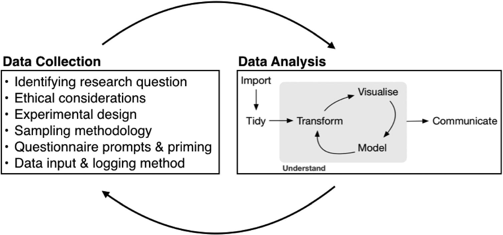

## Agenda

* Reminder: quiz in class on Wednesday
    * 15 minutes
    * open notes (including laptop + internet)
    * closed other people
    * covers through ggplot material (but not dplyr)
* Today:
    * elements and principles of data analysis
    * introduction to regression
    
---

## Filling in the data analysis workflow

.center[

]

---

## Filling in the data analysis workflow

.center[

]

Today:
* **Communicate:** elements and principles of data analysis
* **Model:** introduction to regression

---

## Elements of data analysis

*Elements* of data analysis are the different tools for communicating, summarizing, and using your results, including

* narrative text
* code and code comments
* data visualization
* summary statistics
* tables
* statistical models

---

## Principles of data analysis

Characteristics of a data analysis, which reflect choices and priorities of the analyst.

* Data matching
* Exhaustive
* Skeptical
* Second-order
* Transparency
* Reproducible

We can assess how much weight an analysis gives each principle. This is an evaluation of characteristics of a data analysis, not a judgment of quality.

---

## Data matching

How closely does the data match the research question?

.center[

]

---

## Exhaustive

Does the analyst use multiple elements to investigate the research question?

.center[

]

---

## Skeptical

Does the analyst consider alternative explanations for the observed phenomenon?

.center[

]

---

## Second-order

Does the analyst give context to the analysis?

.center[

]

---

## Transparency

Does the analyst summarize key elements of their analysis?

.center[

]

---

## Reproducible

Would you be able to reproduce the results?

.center[

]

---

## Example: fivethirtyeight NBA article

* *Data matching:* 10/10  The authors are interested in the relationship between the number of fans in basketball arenas, and the outcome of the game. Both variables are measured directly in the data scraped from Basketball-Reference.com.
* *Exhaustive:* 2/10 Their findings depend mainly on the results of one model, and other elements are not used.
* *Skeptical:* 3/10 Only one model is fit, and alternative models with other variables are not considered.
* *Second-order:* 8/10 Good second-order details are provided, such as motivation on the impact of fans in the NBA season, information about how protocols varied around the league, and details on issues and discrepancies in the data.
* *Transparency:* 7/10 The linear regression model is simple enough that reporting the coefficient for fans is fairly understandable, and the confidence interval figure is easy to read. However, the analysis could be made more transparent by adding a visualization showing the relationship between fans and home team advantage, rather than just reporting the model.
* *Reproducible:* 5/10  Most data can be found on Basketball-Reference.com, and the authors describe how they cleaned, prepared, and modeled the data. However, their code is not provided, nor is the final dataset, and there are few details about how the additional data from local news sources was collected.

---

## Modeling

```{r echo=F, message=F, warning=F, fig.align='center',fig.width=6, fig.height=4}
library(gapminder)
library(tidyverse)
gapminder %>%
  filter(year == 2007) %>%
  ggplot(aes(x = gdpPercap, y = lifeExp)) +
  geom_point() +
  labs(x = "GDP per capita (US $)",
       y = "Life expectancy at birth (years)") +
  theme_classic()
```

* Given a value of GDP per capita, what would I predict for life expectancy?
* What is the relationship between GDP per capita and life expectancy?

---

## General model

```{r echo=F, message=F, warning=F, fig.align='center',fig.width=6, fig.height=4}
library(gapminder)
library(tidyverse)
gapminder %>%
  filter(year == 2007) %>%
  ggplot(aes(x = gdpPercap, y = lifeExp)) +
  geom_point() +
  labs(x = "GDP per capita (US $)",
       y = "Life expectancy at birth (years)") +
  theme_classic()
```

.center[
$\text{life expectancy} = f(\text{GDP per capita}) + \varepsilon$
]

--

* $f$ = systematic information that GDP per capita provides about life expectancy (the general trend)
    * $f(\text{GDP per capita})$ = <ins>average</ins> life expectancy given GDP per capita
    * E.g., $f(20000)$ = average life expectancy when GDP per capita = $20000
* $\varepsilon$ = random error term

---

## Regression

```{r echo=F, message=F, warning=F, fig.align='center',fig.width=6, fig.height=4}
library(gapminder)
library(tidyverse)
gapminder %>%
  filter(year == 2007) %>%
  ggplot(aes(x = gdpPercap, y = lifeExp)) +
  geom_point() +
  labs(x = "GDP per capita (US $)",
       y = "Life expectancy at birth (years)") +
  theme_classic()
```

.center[
$\text{life expectancy} = f(\text{GDP per capita}) + \varepsilon$
]

* But, we don't know what $f$ is!
* Regression: estimate $f$

---

## Goals of regression

In general, write

.center[
$y = f(x) + \varepsilon$
]

* $x$ = predictor, aka independent variable
* $y$ = response, aka dependent variable

---

## Goals of regression

.center[
$y = f(x) + \varepsilon$
]

Three different goals:

* **Prediction:** given a value of $x$, what is our "best guess" for the value of $y$?
    * don't care about the form of $f$, just want to get good predictions
--
* **Inference:** What is the relationship between $x$ and $y$?
    * want to get form of $f$ right
--
* **Causal inference:** If I change $x$, how does $y$ change?
    * want to get form of $f$ right
    * need study design that allows for causal conclusions (e.g., randomized experiment)
    
---

## Goals of regression

.center[

]

---

## Prediction, inference, or causal inference?

**Scenario:** A beer company is conducting a social media marketing campaign, and wants to identify individuals who are likely to buy their beer based on Facebook and Instagram activity. The company doesn't care about understanding the relationship, they just want to accurately target likely customers.

.abox[
Prediction
]

.bbox[
Inference
]

.cbox[
Causal inference
]

---

## Prediction, inference, or causal inference?

**Scenario:** The beer company advertises on several different platforms: Facebook, Instagram, Twitter, YouTube, and on several popular podcasts. They want to know whether the amount they spend on each platform is associated with an increase in sales.

.abox[
Prediction
]

.bbox[
Inference
]

.cbox[
Causal inference
]

---

## Prediction, inference, or causal inference?

**Scenario:** The beer company wants to target social media influencers who can help sell their beer. Unfortunately, no one in the company knows any influencers. So they decide to identify influencers by finding Instagram posts with pictures of beer. To do so, the company trains a neural network which takes an Instagram image as input, and outputs either "contains beer" or "does not contain beer". They don't care how the neural network works, they just want to identify images of beer.

.abox[
Prediction
]

.bbox[
Inference
]

.cbox[
Causal inference
]

---

## Prediction, inference, or causal inference?

**Scenario:** The beer company made their Facebook ads with Comic Sans, but it turns out that Comic Sans isn't cool anymore. The company considers switching their advertising font to Papyrus, but they want to know whether changing the font will lead to more sales.

.abox[
Prediction
]

.bbox[
Inference
]

.cbox[
Causal inference
]

---

## Some regression methods

.center[
$y = f(x) + \varepsilon$
]

* Nonparametric regression (minimal assumptions about $f$)
    * tree-based regression
    * local regression
    * smoothing splines
    * neural networks
    * $+$ many more
* Parametric regression (more assumptions about $f$)
    * linear regression (assume $f$ is a linear function of $x$)
    * generalized linear models
    * penalized regression (lasso, ridge, elastic net)
    * $+$ many more
    
---

## Example of nonparametric regression

```{r echo=F, message=F, warning=F, fig.align='center',fig.width=6, fig.height=4}
library(latex2exp)
gapminder %>%
  filter(year == 2007) %>%
  ggplot(aes(x = gdpPercap, y = lifeExp)) +
  geom_point() +
  geom_smooth(se=F, lwd=2) +
  scale_x_continuous(limits = c(0, 55000)) +
  labs(x = "GDP per capita (US $)",
       y = "Life expectancy at birth (years)") +
  annotate("text", x = 53000, y = 77, 
           label = TeX("$\\widehat{f}", output='character'), parse=TRUE, size = 10) +
  theme_classic() +
  theme(text = element_text(size=20))
```

.center[
$\text{life expectancy} = f(\text{GDP per capita}) + \varepsilon$
]

* $\widehat{f}$ (blue curve) is our *estimate* of $f$
* **Assumptions:** nonparametric regression often just assumes $f$ is "smooth"

---

## Example of linear regression

```{r echo=F, message=F, warning=F, fig.align='center',fig.width=6, fig.height=4}
gapminder %>%
  filter(year == 2007) %>%
  ggplot(aes(x = gdpPercap, y = lifeExp)) +
  geom_point() +
  geom_smooth(se=F, lwd=2, method="lm") +
  scale_x_continuous(limits = c(0, 55000)) +
  labs(x = "GDP per capita (US $)",
       y = "Life expectancy at birth (years)") +
  annotate("text", x = 52000, y = 89, 
           label = TeX("$\\widehat{f}", output='character'), parse=TRUE, size = 10) +
  theme_classic() +
  theme(text = element_text(size=20))
```

.center[
$\text{life expectancy} = f(\text{GDP per capita}) + \varepsilon$
]

* $\widehat{f}$ (blue curve) is our *estimate* of $f$
* **Assumptions:** $f$ is <ins>linear</ins>

---

## Linear regression

Sometimes, we can transform the data to make the relationship look linear:

```{r echo=F, message=F, warning=F, fig.align='center',fig.width=6, fig.height=4}
gapminder %>%
  filter(year == 2007) %>%
  ggplot(aes(x = log(gdpPercap), y = lifeExp)) +
  geom_point() +
  geom_smooth(se=F, lwd=2, method="lm") +
  scale_x_continuous(limits = c(5.5, 11.5)) +
  labs(x = "log(GDP per capita) (log US $)",
       y = "Life expectancy at birth (years)") +
  annotate("text", x = 11.3, y = 81, 
           label = TeX("$\\widehat{f}", output='character'),
           parse=TRUE, size = 10) +
  theme_classic() +
  theme(text = element_text(size=20))
```

.center[
$\text{life expectancy} = f(\log(\text{GDP per capita})) + \varepsilon$
]

---

## Linear regression

.pull-left[
```{r echo=F, message=F, warning=F, fig.align='center',fig.width=6, fig.height=4}
gapminder %>%
  filter(year == 2007) %>%
  ggplot(aes(x = log(gdpPercap), y = lifeExp)) +
  geom_point() +
  geom_smooth(se=F, lwd=2, method="lm") +
  scale_x_continuous(limits = c(5.5, 11.5)) +
  labs(x = "log(GDP per capita) (log US $)",
       y = "Life expectancy at birth (years)",
       title = "Linear regression") +
  annotate("text", x = 11.3, y = 81, 
           label = TeX("$\\widehat{f}", output='character'),
           parse=TRUE, size = 10) +
  theme_classic() +
  theme(text = element_text(size=20))
```
]

.pull-right[
```{r echo=F, message=F, warning=F, fig.align='center',fig.width=6, fig.height=4}
gapminder %>%
  filter(year == 2007) %>%
  ggplot(aes(x = log(gdpPercap), y = lifeExp)) +
  geom_point() +
  geom_smooth(se=F, lwd=2) +
  scale_x_continuous(limits = c(5.5, 11.5)) +
  labs(x = "log(GDP per capita) (log US $)",
       y = "Life expectancy at birth (years)",
       title = "Nonparametric regression") +
  annotate("text", x = 11.3, y = 81, 
           label = TeX("$\\widehat{f}", output='character'),
           parse=TRUE, size = 10) +
  theme_classic() +
  theme(text = element_text(size=20))
```
]

--

When the true relationship looks linear, then linear regression is the right choice.

---

## Simple linear regression

One predictor, one response:

.center[
$y = f(x) + \varepsilon$
]

Linear regression: $f(x) = \beta_0 + \beta_1 x$

---

## Simple linear regression

One predictor, one response:

.center[
$y = f(x) + \varepsilon$
]


--

.question[
If we observed all countries in the world, we could model the exact relationship between $x$ and $y$.
]

---

## Simple linear regression

One predictor, one response:

.center[
$y = f(x) + \varepsilon$
]


.question[
But usually, we only have a sample, so we *estimate* the relationship:
]

<br>

.center[
$\widehat{y} = \widehat{\beta}_0 + \widehat{\beta}_1 x$
]

---

## Simple linear regression

One predictor, one response:

.center[
$y = f(x) + \varepsilon$
]


<br>

<br>

.center[

]

---

## Notation

.center[
Assumed truth: $y = \beta_0 + \beta_1 x + \varepsilon$

Estimate from sample: $\widehat{y} = \widehat{\beta}_0 + \widehat{\beta}_1 x$
]

<br>

* $y$ = quantitative response variable
* $x$ = quantitative predictor 
* $\beta_0$ = intercept of true regression line
* $\beta_1$ = slope of true regression line
* $\widehat{\beta}_0$ = intercept of estimated regression line
* $\widehat{\beta}_1$ = slope of estimated regression line
* $\widehat{y}$ = estimated response

---

## Notation

.center[
Assumed truth: $y = \beta_0 + \beta_1 x + \varepsilon$

Estimate from sample: $\widehat{y} = \widehat{\beta}_0 + \widehat{\beta}_1 x$
]

<br>

* $y$ = quantitative response variable 
* $x$ = quantitative predictor
* $\beta_0$ = intercept of true regression line **(parameter)**
* $\beta_1$ = slope of true regression line **(parameter)**
* $\widehat{\beta}_0$ = intercept of estimated regression line **(parameter estimate)**
* $\widehat{\beta}_1$ = slope of estimated regression line **(parameter estimate)**
* $\widehat{y}$ = estimated response

---

## Estimated regression line

```{r echo=F, message=F, warning=F, fig.align='center',fig.width=6, fig.height=4}
gapminder %>%
  filter(year == 2007) %>%
  ggplot(aes(x = log(gdpPercap), y = lifeExp)) +
  geom_point() +
  geom_smooth(se=F, lwd=2, method="lm") +
  labs(x = "log(GDP per capita) (log US $)",
       y = "Life expectancy at birth (years)",
       title = "Linear regression") +
  theme_classic() +
  theme(text = element_text(size=20))
```

.center[
$\widehat{\text{life expectancy}} = 4.95 + 7.20 \log(\text{GDP per capita})$
]

* $\widehat{\beta}_0 = 4.95$
* $\widehat{\beta}_1 = 7.20$

---

## Estimated regression line

.center[
$\widehat{\text{life expectancy}} = 4.95 + 7.20 \log(\text{GDP per capita})$
]

Questions:
* If a country has $\log(\text{GDP per capita}) = 8$, what is the estimated life expectancy?
* If a country has GDP per capita = $2981, what is the estimated life expectancy?

---

## Nonparametric regression vs. linear regression

.pull-left[
**Nonparametric regression**
* Most relationships aren't lines
* More flexible, works in more situations
]

.pull-right[
**Linear regression**
* Right choice if relationship is linear
* Easy interpretation and inference
* Can sometimes transform nonlinear data to look linear
* Can still be useful for prediction even if data is nonlinear
* Computationally cheap
]

--

**In this class:** focus on linear regression (and later logistic regression)

**STA 214 (categorical data):** intro to generalized linear models

**STA 312 (linear models):** more details and theory for linear regression

**STA 363 (statistical learning):** penalized regression, nonparametric regression